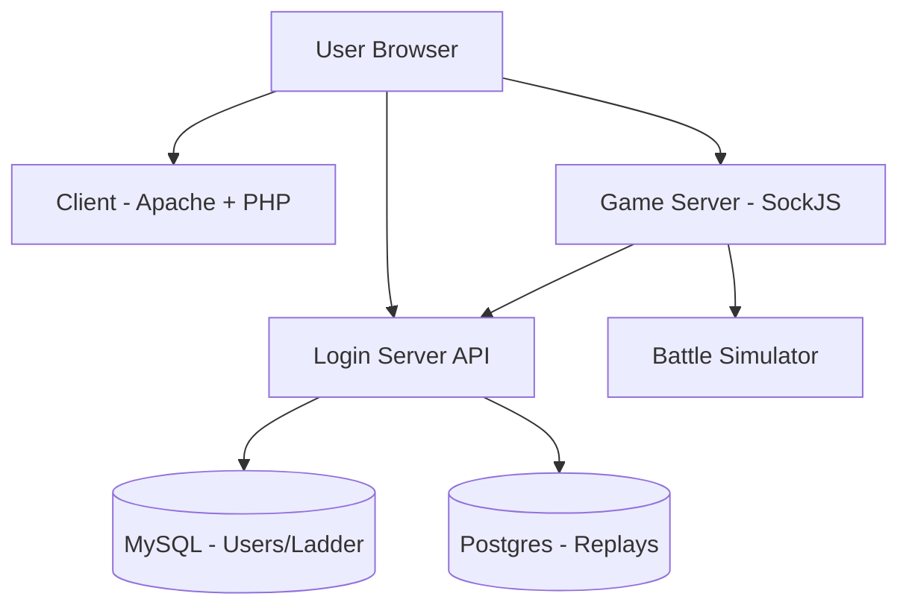

Pokemon Showdown is a comprehensive battle simulator with a multi-component architecture designed for scalability and flexibility.

## System Overview

At the highest level, Pokemon Showdown is split into three major components that communicate directly with each other:

<CardGroup cols={3}>
  <Card title="Game Server" icon="server">
    Handles chat, matchmaking, and battle simulation
  </Card>
  <Card title="Client" icon="desktop">
    Web interface for users to battle
  </Card>
  <Card title="Login Server" icon="key">
    Manages authentication and databases
  </Card>
</CardGroup>

## Component Architecture

### Game Server

The game server is written in **TypeScript** and runs on **Node.js**. It's the core of the Pokemon Showdown system.

<Steps>
  <Step title="Entry Point">
    The server starts at `server/index.ts`, which launches several major components:
  </Step>

  <Step title="Socket Management">
    `server/sockets.ts` sets up a SockJS (abstracted WebSocket) server to accept connections from clients.
  </Step>

  <Step title="User Management">
    `server/users.ts` wraps SockJS connections in a user management system.
  </Step>

  <Step title="Room Management">
    `server/rooms.ts` handles individual chat rooms and battle rooms.
  </Step>

  <Step title="Chat System">
    `server/chat.ts` processes chat commands and messages from users. All client-to-server commands are routed through the chat system.
  </Step>
</Steps>

#### Battle Simulation

The `Rooms` system includes support for battle rooms, which connect to the game simulator. All game simulation code lives in the `sim/` directory.

```typescript
// Battle simulation is integrated into rooms
import { BattleStream } from './sim/battle-stream';
import { Teams } from './sim/teams';

// The simulator uses streams for battle communication
const stream = new BattleStream();
```

<Note>
  The simulator can be used as a standalone library via npm: `npm install pokemon-showdown`
</Note>

### Client

The client is built with a mix of **TypeScript** and **JavaScript**, using a mostly hand-rolled framework built on Backbone.

**Key Details:**
- Entry point: `index.template.html`
- Main logic: `js/client.js`
- Architecture: Legacy design with multiple JS files (pre-dates modern bundlers)
- Migration status: Rewrite to Preact is in progress but stalled

<Warning>
  The client uses an older architecture pattern. A Preact rewrite is planned but not yet complete.
</Warning>

### Login Server

The login server handles authentication and database operations. It's written in **TypeScript**.

**Architecture:**
- Entry point: `server.ts`
- **MySQL InnoDB** database: Users, ladder, and most data
- **Postgres (Cockroach)** database: Replays
- Migration: Replacing legacy PHP code from the client (halfway complete)

## Communication Flow

Here's how the components interact when a user plays:

<Steps>
  <Step title="Initial Connection">
    User visits `https://play.pokemonshowdown.com/`, served by Apache (static files + legacy PHP).
  </Step>

  <Step title="Authentication">
    Browser communicates with Login Server at `https://play.pokemonshowdown.com/api/` for authentication and database operations.
  </Step>

  <Step title="Game Connection">
    Browser connects to Game Server via SockJS for chat rooms, matchmaking, and battles.
  </Step>

  <Step title="Replay Storage">
    Game Server communicates with Login Server to handle replay uploads and ladder updates.
  </Step>
</Steps>



## Technology Stack

<CardGroup cols={2}>
  <Card title="Game Server" icon="node">
    - **Runtime**: Node.js v16+
    - **Language**: TypeScript
    - **WebSockets**: SockJS
    - **Simulation**: Custom battle engine
  </Card>
  <Card title="Client" icon="browser">
    - **Framework**: Backbone (migrating to Preact)
    - **Languages**: TypeScript + JavaScript
    - **Server**: Apache
    - **Legacy**: PHP (being replaced)
  </Card>
  <Card title="Login Server" icon="database">
    - **Language**: TypeScript
    - **Databases**: MySQL InnoDB, Postgres
    - **Purpose**: Auth + data persistence
  </Card>
  <Card title="Simulator" icon="gear">
    - **Language**: TypeScript
    - **Generations**: 1-9 support
    - **Formats**: Singles, doubles, triples
    - **API**: Stream-based
  </Card>
</CardGroup>

## Core Modules

The game server is organized into several key modules:

| Module | Location | Purpose |
|--------|----------|----------|
| **Sockets** | `server/sockets.ts` | WebSocket connection management |
| **Users** | `server/users.ts` | User session and authentication |
| **Rooms** | `server/rooms.ts` | Chat and battle room logic |
| **Chat** | `server/chat.ts` | Command processing and messaging |
| **Simulator** | `sim/` | Battle engine and game mechanics |
| **Dex** | `sim/dex.ts` | Pokemon data and Pokedex |
| **Teams** | `sim/teams.ts` | Team validation and generation |

## Battle Simulator Architecture

The simulator implements an `ObjectReadWriteStream` pattern:

- **Write**: Player choices (strings)
- **Read**: Protocol messages (strings)

```typescript
import { BattleStream } from 'pokemon-showdown';

const stream = new BattleStream();

// Write commands to the simulator
stream.write(`>start {"formatid":"gen7randombattle"}`);
stream.write(`>player p1 {"name":"Alice"}`);
stream.write(`>player p2 {"name":"Bob"}`);

// Read battle messages
for await (const output of stream) {
    console.log(output);
}
```

### Simulator Components

<CardGroup cols={2}>
  <Card title="Battle Stream" icon="stream">
    Core communication layer using streams
  </Card>
  <Card title="Battle Engine" icon="chess">
    Game logic, moves, abilities, items
  </Card>
  <Card title="Dex" icon="book-open">
    Pokemon species, moves, abilities data
  </Card>
  <Card title="Team Validator" icon="check">
    Format rules and team validation
  </Card>
</CardGroup>

## Running Your Own Server

The game server can be run independently for hosting custom communities:

```bash
# Install and run
./pokemon-showdown

# Or with Node.js directly
node pokemon-showdown

# Specify a port
node pokemon-showdown 8000
```

<Note>
  Default port is 8000. Visit your server at `http://localhost:8000` for local testing.
</Note>

## Repository Links

<CardGroup cols={3}>
  <Card title="Server" icon="github" href="https://github.com/smogon/pokemon-showdown">
    Game server repository
  </Card>
  <Card title="Client" icon="github" href="https://github.com/smogon/pokemon-showdown-client">
    Client repository
  </Card>
  <Card title="Login Server" icon="github" href="https://github.com/smogon/pokemon-showdown-loginserver">
    Login server repository
  </Card>
</CardGroup>

## Design Philosophy

<CardGroup cols={2}>
  <Card title="Modularity" icon="cubes">
    Clear separation between server, client, and auth
  </Card>
  <Card title="Extensibility" icon="puzzle-piece">
    Custom game modes and formats supported
  </Card>
  <Card title="Streams" icon="water">
    Stream-based architecture for battle simulation
  </Card>
  <Card title="TypeScript" icon="code">
    Fully typed API with comprehensive definitions
  </Card>
</CardGroup>

## Next Steps

<CardGroup cols={2}>
  <Card title="Battle Simulator" icon="code" href="/simulator/overview">
    Learn the simulator API in detail
  </Card>
  <Card title="Protocol" icon="file-code" href="/protocol/overview">
    Understand the communication protocol
  </Card>
  <Card title="Running a Server" icon="server" href="/server/installation">
    Host your own Pokemon Showdown server
  </Card>
  <Card title="Contributing" icon="code-pull-request" href="/contributing">
    Contribute to the project
  </Card>
</CardGroup>